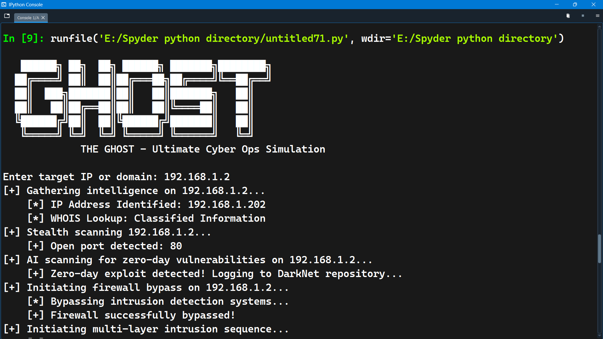

#  **GHOST.AI** - *The AI Hacker*  
###  *An Idea to Mix Cyber & AI for the Ultimate Hacking Machine*  
# Hey Make Sure You Atleast Copy Paste The Python Code And Run In Your Console To see How It Feels
  

---

## 🔥 **What is GHOST.AI?**  
**GHOST.AI** is a next-gen AI-powered cyber ops simulation that blends **cyber warfare** and **machine learning** to create the most **autonomous hacking system ever conceived.**  

> *"Not just a hacker. Not just an AI. This is The Ghost."*  

It **mimics real-world cyber attack strategies**, **adapts like a human hacker**, and **executes advanced penetration tactics—all automated by AI.**  

---

## 🛠 **How GHOST.AI Operates**  

### **1️⃣ Reconnaissance & Target Scanning** 🕵️‍♂️  
- Uses **stealth scanning** to detect open ports & vulnerabilities.  
- **WHOIS & OSINT lookups** gather intelligence on the target.  
- AI-driven **zero-day vulnerability detection** for potential attack points.  

### **2️⃣ Intrusion & Exploitation** 🛡️  
- **Firewall bypass** methods ensure stealth entry.  
- **Privilege escalation techniques** grant deep system control.  
- Deploys **adaptive malware payloads** for persistence.  

### **3️⃣ AI-Driven Attack Adaptation** 🎭  
- AI **switches attack strategies dynamically** based on target defenses.  
- If detected, it engages **evasive countermeasures** automatically.  
- **Multi-vector attack sequencing** ensures continuous exploitation.  

### **4️⃣ Data Exfiltration & Command Control** 📡  
- Encrypts and transmits **stolen data securely**.  
- **AI C2 (Command & Control) system** manages long-term access.  
- Simulates **real-world cyber espionage techniques**.  

### **5️⃣ AI-Generated Phishing & Social Engineering** 🎭  
- Deploys **deepfake voice AI & chatbot social engineering**.  
- Uses **spoofed MFA attacks** to steal credentials.  
- Automated AI phishing **tricks victims into revealing sensitive data**.  

### **6️⃣ Self-Destruct Protocol** 💣  
- Wipes all logs **to erase any digital footprints**.  
- **Data shredding & encryption cloaking** ensure undetectable ops.  
- The AI **purges itself upon mission completion** to stay ghost-like.  
## lets learn and build the real one together in future 
---

## 🚀 **Installation & Setup**  

```bash
git clone https://github.com/shivadeepak99/Ghost.ai.git
cd Ghost.ai
pip install -r requirements.txt
python ghost.py


